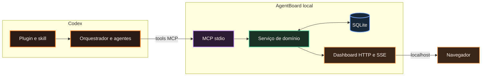
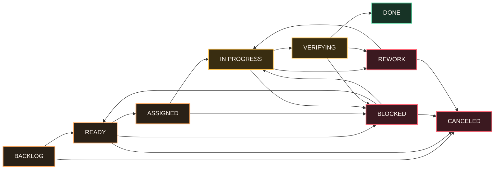
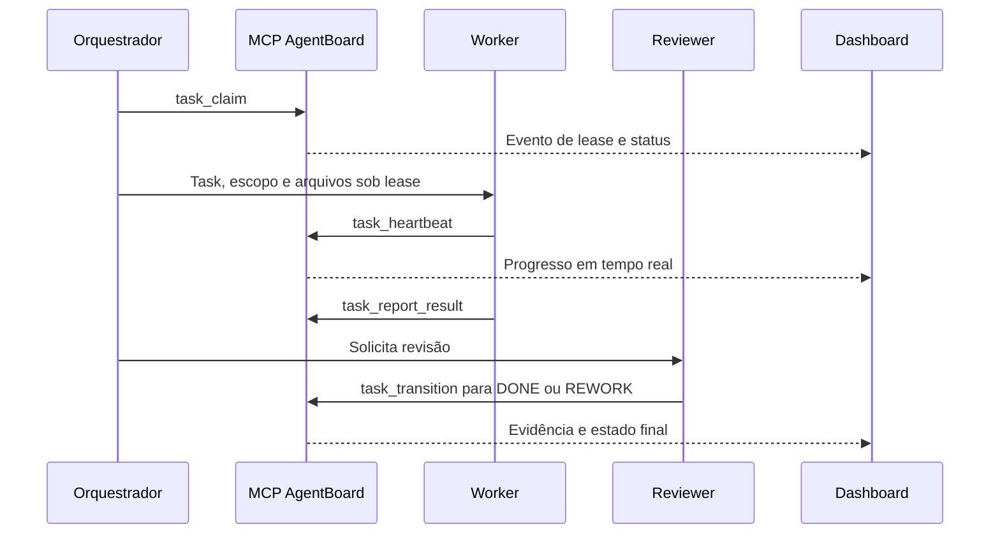

# AgentBoard

Control plane local-first para agentes de desenvolvimento com IA. O AgentBoard combina um plugin Codex, um servidor MCP, um dashboard local e orquestração de tasks persistida em SQLite.

## Status do projeto

O repositório contém a fundação arquitetural e os contratos do primeiro fluxo vertical. Ele ainda não é um pacote publicado nem um plugin pronto para produção.

## Objetivos

- Coordenar tasks de desenvolvimento entre agentes Codex.
- Aplicar dependências, limites de WIP, leases de tasks e transições de estado válidas.
- Manter a configuração no Git e o histórico operacional em SQLite local.
- Expor as mesmas regras de domínio por tools MCP e por um dashboard web local.
- Manter os serviços em `localhost` e ativos somente enquanto o Codex estiver em execução no MVP.

## Visão da solução



O Codex usa o MCP para executar operações do AgentBoard. O dashboard é uma interface web local e consulta o mesmo serviço de domínio; ele não acessa o banco diretamente.

## Fluxo de uma task



As mudanças de estado são validadas pelo serviço de domínio. O AgentBoard verifica dependências, limite de WIP, lease ativo, versão esperada e evidências antes de aceitar uma transição.

## Ciclo operacional



## Estrutura do repositório

| Caminho | Finalidade |
| --- | --- |
| `src/agentboard/` | Domínio Python, persistência, serviços e adapters MCP/web |
| `web/` | Código-fonte do dashboard React/Vite |
| `skills/` | Fluxo Codex para orquestração de tasks |
| `.codex/agents/` | Perfis de agentes específicos do projeto |
| `config/` | Exemplos versionados de configuração de orquestração |
| `docs/` | Arquitetura e documentação de desenvolvimento |
| `tests/` | Testes do domínio e dos adapters |

## Desenvolvimento

```bash
uv sync --all-groups
uv run pytest
uv run ruff check .
uv run agentboard --help
```

Leia o [guia de desenvolvimento](DEVELOPMENT_GUIDE.md) antes de implementar uma funcionalidade. As regras específicas para o Codex estão em [AGENTS.md](AGENTS.md).

## Licença

Apache-2.0
